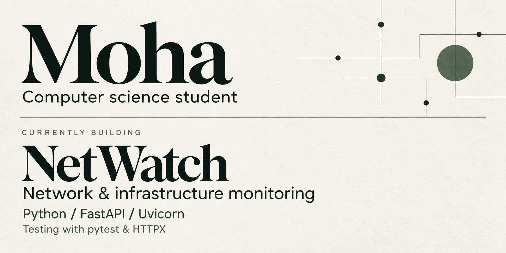

  <a href="https://github.com/itsMoha963/NetWatch"><strong>Explore NetWatch</strong></a>
  &nbsp;&nbsp;·&nbsp;&nbsp;
  <a href="https://github.com/itsMoha963?tab=repositories">All repositories</a>

## Selected work

<table>
  <tr>
    <td width="50%" valign="top">
      <h3><a href="https://github.com/itsMoha963/OnlyBikes">OnlyBikes</a></h3>
      
Bike routing for Frankfurt am Main.

      
Flutter &nbsp;·&nbsp; Flask &nbsp;·&nbsp; PostGIS

    </td>
    <td width="50%" valign="top">
      <h3><a href="https://github.com/itsMoha963/DroneSimulationInterface">Drone Simulation Interface</a></h3>
      
A Java drone simulation interface, developed with a university team.

      
Java

    </td>
  </tr>
</table>

<strong>Languages &amp; tools</strong>

**Languages** · Python, C, C++, C#, Java, JavaScript, TypeScript 
**Web & data** · HTML, CSS, Node.js, MySQL 
**Tools** · Git, Linux 
**Design** · Figma, Illustrator, Photoshop

 

  

